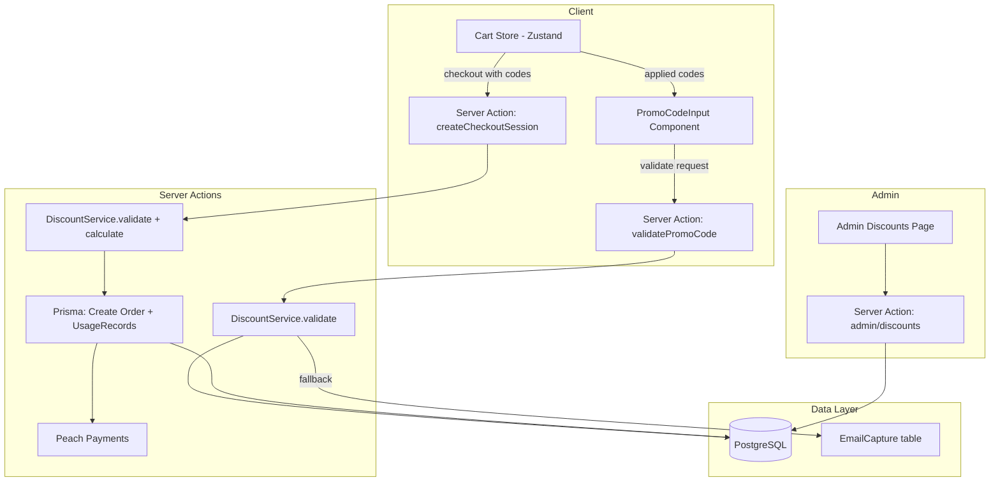

# Design Document: Discount & Promo Codes

## Overview

This design implements a comprehensive discount and promotional code system for the Lusso candle store. The system enables admins to create and manage discount codes through a dedicated admin interface, and customers to apply promo codes during checkout for percentage-off, fixed-amount, or free-shipping discounts.

The architecture follows the existing patterns in the codebase: Prisma models for persistence, Next.js Server Actions for business logic, Zustand for client state, and the existing admin shell for management UI. The core discount logic lives in a pure `DiscountService` module that handles validation, calculation, and stacking — making it independently testable.

Key design decisions:
- **Pure calculation layer**: Discount validation and calculation are implemented as pure functions that accept data parameters, keeping them decoupled from database I/O for testability.
- **Server-side re-validation**: Applied codes are always re-validated server-side at checkout time to prevent client-side tampering.
- **EmailCapture bridge**: Rather than migrating existing email capture codes, the system falls back to the `EmailCapture` table when a code isn't found in `DiscountCode`, treating it as a virtual 10% single-use discount.
- **Cents-based arithmetic**: All monetary values remain as integers in ZAR cents, consistent with existing `Product.price` and `Order.totalAmountZAR`.

## Architecture



The system introduces three layers:
1. **Data Layer** — New Prisma models (`DiscountCode`, `DiscountUsage`) plus integration with existing `EmailCapture`.
2. **Service Layer** — `src/lib/discounts/` containing pure validation/calculation functions and a database-facing service.
3. **Presentation Layer** — Customer-facing `PromoCodeInput` component in the cart, and admin pages at `/admin/discounts`.

## Components and Interfaces

### 1. Discount Service (`src/lib/discounts/`)

```typescript
// src/lib/discounts/types.ts
export type DiscountType = 'PERCENTAGE' | 'FIXED_AMOUNT' | 'FREE_SHIPPING';

export interface DiscountCodeData {
  id: string;
  code: string;
  type: DiscountType;
  value: number; // percentage (1-100) or ZAR cents
  minOrderAmountZAR: number; // in cents, 0 = no minimum
  maxUsageCount: number | null; // null = unlimited
  perUserLimit: number | null; // null = unlimited
  maxDiscountAmountZAR: number | null; // cap for percentage, null = no cap
  stackable: boolean;
  startDate: Date | null;
  endDate: Date | null;
  active: boolean;
  applicableProductIds: string[]; // empty = all products
}

export interface CartItemForDiscount {
  productId: string;
  price: number; // ZAR cents
  quantity: number;
}

export interface AppliedDiscount {
  codeId: string; // DiscountCode.id or `emailcapture:${code}`
  code: string;
  type: DiscountType;
  discountAmountZAR: number; // calculated discount in cents
  isEmailCapture: boolean;
}

export interface ValidationSuccess {
  valid: true;
  discount: AppliedDiscount;
}

export interface ValidationError {
  valid: false;
  error: string;
}

export type ValidationResult = ValidationSuccess | ValidationError;
```

```typescript
// src/lib/discounts/calculate.ts — Pure functions (no I/O)
export function calculateApplicableSubtotal(
  items: CartItemForDiscount[],
  applicableProductIds: string[]
): number;

export function calculateDiscount(
  code: DiscountCodeData,
  applicableSubtotal: number
): number;

export function calculateTotalDiscount(
  discounts: AppliedDiscount[],
  cartSubtotal: number
): number;

export function generatePromoCode(): string; // 8-char alphanumeric
```

```typescript
// src/lib/discounts/validate.ts — Pure validation logic
export function validateDiscountConditions(
  code: DiscountCodeData,
  cartItems: CartItemForDiscount[],
  cartSubtotal: number,
  currentUsageCount: number,
  userUsageCount: number,
  now: Date
): ValidationResult;
```

```typescript
// src/lib/discounts/service.ts — Database-facing orchestrator
export async function validatePromoCode(
  codeString: string,
  cartItems: CartItemForDiscount[],
  userId: string
): Promise<ValidationResult>;

export async function validateStackingRules(
  newCode: DiscountCodeData,
  existingDiscounts: AppliedDiscount[]
): ValidationResult;

export async function recordUsage(
  discountCodeId: string,
  userId: string,
  orderId: string,
  discountAmountZAR: number
): Promise<void>;

export async function getDiscountStats(codeId: string): Promise<{
  totalRedemptions: number;
  totalDiscountGiven: number;
  recentRedemptions: Array<{
    userEmail: string;
    orderId: string;
    discountAmount: number;
    date: Date;
  }>;
}>;
```

### 2. Server Actions

```typescript
// src/actions/discounts.ts — Customer-facing
export async function applyPromoCode(
  code: string,
  cartItems: CartItemForDiscount[],
  existingDiscounts: AppliedDiscount[]
): Promise<ValidationResult>;

export async function removePromoCode(
  codeId: string,
  existingDiscounts: AppliedDiscount[]
): Promise<{ discounts: AppliedDiscount[] }>;
```

```typescript
// src/actions/admin/discounts.ts — Admin CRUD
export async function createDiscountCode(data: CreateDiscountInput): Promise<{ id: string } | { error: string }>;
export async function updateDiscountCode(id: string, data: UpdateDiscountInput): Promise<{ success: true } | { error: string }>;
export async function toggleDiscountActive(id: string, active: boolean): Promise<{ success: true } | { error: string }>;
export async function getDiscountCodes(search?: string): Promise<DiscountCodeWithStats[]>;
export async function getDiscountDetail(id: string): Promise<DiscountDetail | null>;
```

### 3. Cart Store Extensions

```typescript
// Added to CartStore interface
interface CartStore {
  // ... existing fields
  appliedDiscounts: AppliedDiscount[];
  addDiscount: (discount: AppliedDiscount) => void;
  removeDiscount: (codeId: string) => void;
  clearDiscounts: () => void;
}
```

### 4. UI Components

- `src/components/cart/PromoCodeInput.tsx` — Input field + Apply button + applied codes list
- `src/app/admin/discounts/page.tsx` — Listing page with table and search
- `src/app/admin/discounts/new/page.tsx` — Create form
- `src/app/admin/discounts/[id]/edit/page.tsx` — Edit form
- `src/components/admin/discounts/DiscountForm.tsx` — Shared form component
- `src/components/admin/discounts/DiscountTable.tsx` — Table with status badges
- `src/components/admin/discounts/DiscountDetail.tsx` — Usage stats detail panel

### 5. Checkout Integration

The existing `createCheckoutSession` in `src/actions/checkout.ts` will be extended to:
1. Accept `appliedDiscounts: AppliedDiscount[]` as a parameter
2. Re-validate each code server-side via `DiscountService`
3. Calculate the reduced `totalAmountZAR`
4. Store discount metadata in the Order record (new JSON field `discountData`)
5. Create `DiscountUsage` records on successful order creation
6. Skip Peach Payments if total is zero

## Data Models

### New Prisma Schema Additions

```prisma
// ─── Discount Enums ───────────────────────────────────────────────

enum DiscountType {
  PERCENTAGE
  FIXED_AMOUNT
  FREE_SHIPPING
}

// ─── Discount Code ────────────────────────────────────────────────

model DiscountCode {
  id                   String         @id @default(cuid())
  code                 String         @unique  // case-insensitive enforced at app level + DB collation
  type                 DiscountType
  value                Int            // percentage (1-100) or ZAR cents for FIXED_AMOUNT, 0 for FREE_SHIPPING
  minOrderAmountZAR    Int            @default(0)
  maxUsageCount        Int?           // null = unlimited
  perUserLimit         Int?           // null = unlimited
  maxDiscountAmountZAR Int?           // cap for percentage type, null = no cap
  stackable            Boolean        @default(false)
  startDate            DateTime?
  endDate              DateTime?
  active               Boolean        @default(true)
  applicableProductIds String[]       // empty array = all products
  usages               DiscountUsage[]
  createdAt            DateTime       @default(now())
  updatedAt            DateTime       @updatedAt

  @@index([active, startDate, endDate])
}

// ─── Discount Usage ───────────────────────────────────────────────

model DiscountUsage {
  id               String   @id @default(cuid())
  discountCodeId   String?  // null for email capture codes
  emailCaptureCode String?  // set for email capture code redemptions
  userId           String
  orderId          String
  discountAmountZAR Int     // actual discount applied in ZAR cents
  createdAt        DateTime @default(now())

  discountCode DiscountCode? @relation(fields: [discountCodeId], references: [id], onDelete: SetNull)

  @@index([discountCodeId])
  @@index([userId])
  @@index([emailCaptureCode])
}
```

### Order Model Extension

```prisma
model Order {
  // ... existing fields
  discountData Json? // { codes: [{code, type, amount}], totalDiscount: number }
}
```

### Case-Insensitive Code Lookup

The `code` field uses a unique constraint. Case-insensitive lookup is enforced at the application layer using `mode: 'insensitive'` in Prisma queries:

```typescript
prisma.discountCode.findFirst({
  where: { code: { equals: inputCode, mode: 'insensitive' } }
})
```

### EmailCapture Integration

When a code is not found in `DiscountCode`, the service falls back to:

```typescript
prisma.emailCapture.findFirst({
  where: { discountCode: { equals: inputCode, mode: 'insensitive' } }
})
```

If found, it's treated as a virtual `DiscountCodeData` with:
- `type: 'PERCENTAGE'`
- `value: 10`
- `stackable: false`
- `maxUsageCount: 1` (per-code, not per-user)
- No minimum, no expiration, no product restrictions

Usage is tracked via `DiscountUsage` with `emailCaptureCode` set and `discountCodeId` null.

## Correctness Properties

*A property is a characteristic or behavior that should hold true across all valid executions of a system — essentially, a formal statement about what the system should do. Properties serve as the bridge between human-readable specifications and machine-verifiable correctness guarantees.*

### Property 1: Discount Code Schema Round-Trip

*For any* valid DiscountCode configuration (with valid type, value, dates, product IDs, and flags), creating it in the database and reading it back SHALL produce an equivalent object with all fields preserved.

**Validates: Requirements 1.1, 1.4, 1.7, 1.8**

### Property 2: Case-Insensitive Code Uniqueness

*For any* two code strings that are equal when compared case-insensitively, creating a DiscountCode with the first and then attempting to create another with the second SHALL fail with a uniqueness error.

**Validates: Requirements 1.2, 9.5**

### Property 3: Validation Input Constraints

*For any* DiscountCode creation input, the service SHALL accept percentage values in [1, 100] and reject values outside that range; SHALL accept fixed amounts that are positive integers and reject zero or negative; and SHALL reject inputs where startDate is after endDate.

**Validates: Requirements 1.5, 1.6, 9.6**

### Property 4: Validation Pipeline Correctness

*For any* discount code, cart, user, and current time combination, the validation function SHALL return success if and only if ALL of the following hold: the code exists (case-insensitive), the code is active, the current time is within [startDate, endDate], total usage is below maxUsageCount, user usage is below perUserLimit, the cart subtotal meets the minimum order amount, and at least one cart item matches the applicable product list (if restricted). When any condition fails, the specific error message corresponding to the first failing condition SHALL be returned.

**Validates: Requirements 2.1, 2.2, 2.3, 2.4, 2.5, 2.6, 2.7, 2.8, 2.9**

### Property 5: Discount Calculation Correctness

*For any* valid discount code and cart items, the calculated discount SHALL equal:
- For PERCENTAGE type: `min(Math.round(applicableSubtotal * value / 100), maxDiscountAmountZAR ?? Infinity)`
- For FIXED_AMOUNT type: `min(value, applicableSubtotal)`
- For FREE_SHIPPING type: the shipping cost amount

Where `applicableSubtotal` equals the sum of `(price * quantity)` for cart items whose `productId` is in `applicableProductIds` (or all items if the list is empty). The final discount SHALL never exceed the applicable subtotal.

**Validates: Requirements 3.1, 3.2, 3.3, 3.4, 3.5, 3.6, 3.7**

### Property 6: Stacking Rules Enforcement

*For any* set of applied discount codes and a new code being applied: if a non-stackable code is already applied, no additional code (stackable or non-stackable) SHALL be accepted; if only stackable codes are applied, any new stackable code SHALL be accepted; a non-stackable code SHALL only be accepted when no other codes are currently applied.

**Validates: Requirements 4.1, 4.2, 4.3, 4.4**

### Property 7: Multiple Discount Summation with Cap

*For any* set of stackable discount codes applied to a cart, the total discount SHALL equal the minimum of (the sum of individual discounts each calculated on the original subtotal) and the cart subtotal. The resulting order total SHALL never be negative.

**Validates: Requirements 4.5, 4.6**

### Property 8: Cart Store Discount Persistence Round-Trip

*For any* applied discount added to the cart store, serializing the store state to localStorage and deserializing it back SHALL preserve the discount code ID, code string, type, and discount amount.

**Validates: Requirements 5.4, 5.7**

### Property 9: Checkout Total Calculation

*For any* cart with items, applied valid discounts, and optional gift wrap, the checkout `totalAmountZAR` SHALL equal `max(cartSubtotal - totalDiscount, 0) + (giftWrap ? 4900 : 0)`. When the result is zero, the order SHALL be marked PAID without a payment gateway call.

**Validates: Requirements 6.3, 6.7**

### Property 10: Email Capture Code Fallback

*For any* code string that exists in the `EmailCapture.discountCode` column but not in the `DiscountCode` table, the validation function SHALL treat it as a valid PERCENTAGE discount with value 10, no minimum order, no expiration, not stackable, and max 1 total redemption.

**Validates: Requirements 7.1**

### Property 11: Email Capture Single-Use Enforcement

*For any* email capture code that has been redeemed once (has a DiscountUsage record with matching `emailCaptureCode`), subsequent validation attempts SHALL be rejected regardless of which user attempts to redeem it.

**Validates: Requirements 7.3**

### Property 12: Code Status Badge Computation

*For any* DiscountCode, the status badge SHALL display "valid" if and only if `active` is true AND (startDate is null OR startDate ≤ now) AND (endDate is null OR endDate ≥ now) AND (maxUsageCount is null OR current usage count < maxUsageCount). Otherwise it SHALL display "invalid" with the appropriate reason.

**Validates: Requirements 8.6**

### Property 13: Revenue Impact Summation

*For any* DiscountCode, the total revenue impact SHALL equal the sum of `discountAmountZAR` across all DiscountUsage records linked to that code.

**Validates: Requirements 10.4**

### Property 14: Code Generation Format

*For any* invocation of the code generator function, the output SHALL be exactly 8 characters long and contain only uppercase alphanumeric characters (A-Z, 0-9).

**Validates: Requirements 9.7**

## Error Handling

### Validation Errors (Customer-Facing)

All validation errors return a `{ valid: false, error: string }` result with user-friendly messages as specified in Requirement 2. The `PromoCodeInput` component displays these below the input in red text.

| Condition | Error Message |
|-----------|---------------|
| Code not found | "Invalid promo code." |
| Code inactive | "This code is no longer active." |
| Before start date | "This code is not yet valid." |
| After end date | "This code has expired." |
| Global usage exhausted | "This code has reached its usage limit." |
| Per-user usage exhausted | "You have already used this code." |
| Below minimum order | "Minimum order of R{amount} required for this code." |
| No matching products | "This code does not apply to items in your cart." |
| Non-stackable conflict | "This code cannot be combined with other discounts. Remove the existing code first." |
| Stackable + non-stackable conflict | "Cannot add more codes when a non-stackable discount is applied." |

### Checkout Errors

If server-side re-validation fails at checkout:
- Return `{ error: "Discount code '{code}' is no longer valid: {reason}. Please remove it and try again." }`
- The client removes the invalid code from the cart store and displays the error.

### Admin Form Errors

- Duplicate code: "A code with this name already exists."
- Invalid percentage: "Percentage must be between 1 and 100."
- Invalid fixed amount: "Amount must be a positive number."
- Invalid dates: "Start date must be before end date."
- Unauthorized: Redirect to sign-in (handled by existing admin layout guard).

### Race Conditions

- **Usage count race**: Use a database transaction when recording usage that re-checks the count inside the transaction to prevent over-redemption.
- **Concurrent checkout**: The `DiscountUsage` create is wrapped in the same transaction as `Order` creation, ensuring atomicity.

## Testing Strategy

### Property-Based Tests (fast-check)

The project already uses `fast-check` (v4.7.0) with `vitest` (v4.1.5). Each correctness property maps to a property-based test with minimum 100 iterations.

**Test files:**
- `src/lib/discounts/__tests__/calculate.property.test.ts` — Properties 5, 7, 9, 14
- `src/lib/discounts/__tests__/validate.property.test.ts` — Properties 3, 4, 6, 10, 11, 12
- `src/store/__tests__/cartStore.property.test.ts` — Property 8

**Configuration:**
- Each test runs with `{ numRuns: 100 }` minimum
- Each test is tagged with: `// Feature: discount-promo-codes, Property N: {title}`

**PBT library:** `fast-check` (already in devDependencies)

### Unit Tests (Example-Based)

- `src/lib/discounts/__tests__/calculate.test.ts` — Specific calculation examples and edge cases
- `src/lib/discounts/__tests__/validate.test.ts` — Specific validation scenarios
- `src/lib/discounts/__tests__/service.test.ts` — Service layer with mocked Prisma
- `src/actions/__tests__/discounts.test.ts` — Server action tests

### Integration Tests

- `src/actions/__tests__/checkout-discount.integration.test.ts` — Full checkout flow with discounts
- `src/actions/admin/__tests__/discounts.integration.test.ts` — Admin CRUD operations

### Component Tests

- `src/components/cart/__tests__/PromoCodeInput.test.tsx` — UI rendering and interactions
- `src/components/admin/discounts/__tests__/DiscountForm.test.tsx` — Form validation and submission

### Test Priorities

1. **Critical (property tests):** Discount calculation, validation pipeline, stacking rules
2. **High (unit tests):** Email capture bridge, checkout integration, usage tracking
3. **Medium (component tests):** PromoCodeInput states, admin form validation
4. **Low (integration):** Full E2E checkout with discounts, admin CRUD
